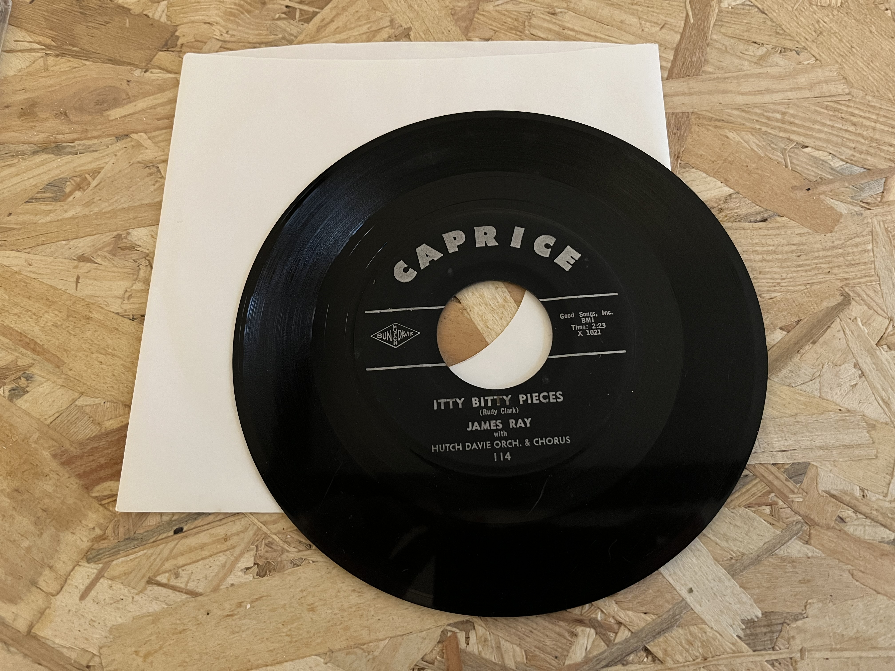
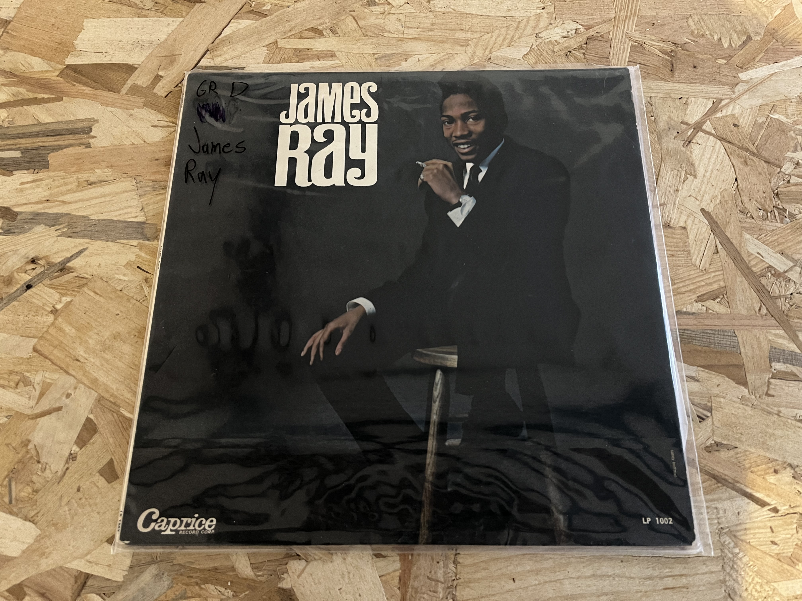
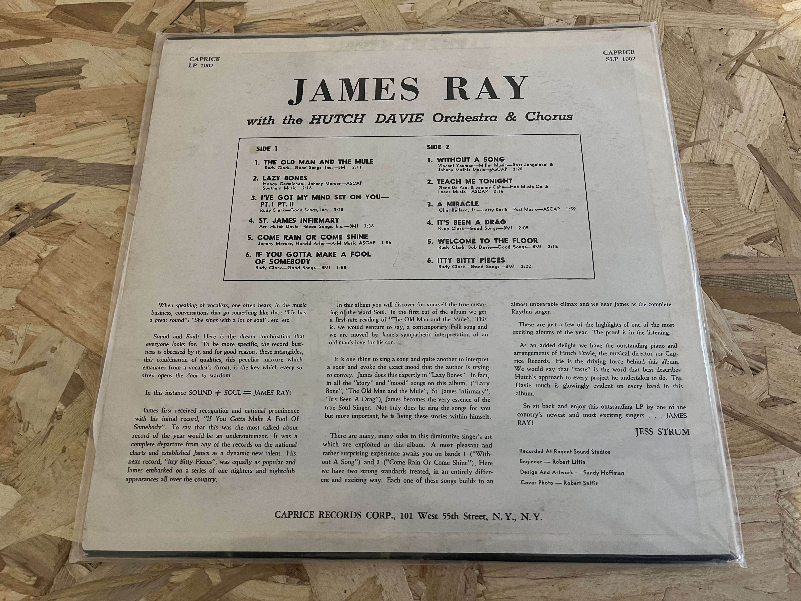
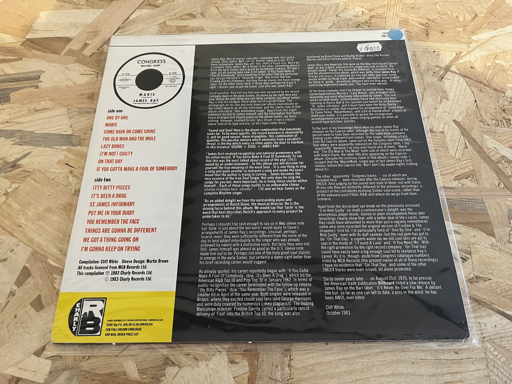
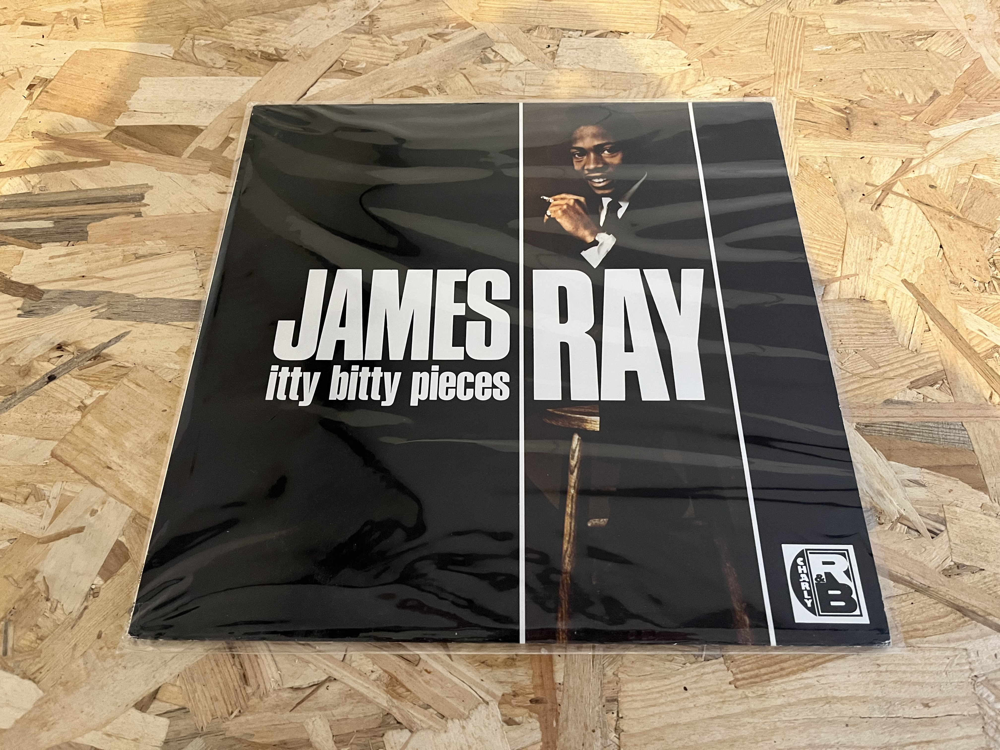

It's been a while since the previous post (~6 months), but i did and found few things that i can share.

First, i worked several times on the lyrics transcription, thanks to [Whisper AI](https://openai.com/research/whisper) for the most complicated songs, and it's almost done (see [songs](./songs.md) page).

In the same time i was seeking for some informations in availables databases (Ancestry, records of NYC, death indexes, obituaries, ...), and i can tell that it's really complicated to obtain informations about people who leaved in the pre-computer/web era. I didn't found anything valuable, even with Ancestry... . 

Here is a list of websites used for the research:
- [NYC Department of Records - Historical Vital Records](https://a860-historicalvitalrecords.nyc.gov/digital-vital-records)
- [Health Data NY State - Death Index](https://health.data.ny.gov/Health/Genealogical-Research-Death-Index-Beginning-1957/vafa-pf2s)
- [New York City Death Indexes](https://www.deathindexes.com/newyork/city.html)
- [Ancestry](https://www.ancestry.com/)
- [NYS Historic Newspaper](https://nyshistoricnewspapers.org/)
- [PhillyHistory.org](https://www.phillyhistory.org/PhotoArchive/Home.aspx)
- [Congress Album Discography](https://www.bsnpubs.com/mca/congress/congress.html)

Next, i purchased several vinyls as i was hoping to find some clues on it, and one of them (James Ray - Itty Bitty, [Charly Records](https://www.charly.co.uk/)) is interesting as it includes a James Ray musical biography. For example, we can learn that a song called "It'll Never Be Over For Me" was released on August 21st 1970, nearly seven years after James Ray death, but remains lost.

<table>
  <tbody>
    <tr>
      <td></td>
      <td></td>
      <td></td>
      <td></td>
      <td></td>
    </tr>
  </tbody>
</table>

A reference on the Wikipedia page lead me to obtain a copy of the magazine [Blues and Rythm](http://www.bluesandrhythm.co.uk/) No 351, and __i finally found the most interesting and complete article about James Ray life__ by Mike Fenton, with an interview of [Gerry Granahan](https://en.wikipedia.org/wiki/Gerry_Granahan) (Caprice Records - producer). I will continue my research based on the inputs from this article. This one is available here: [James Ray - "THE LOST SOUL MAN"](./mirrors/biography-mike-fenton.md).

<table>
  <tbody>
    <tr>
      <td></td>
      <td></td>
      <td></td>
      <td></td>
      <td></td>
    </tr>
  </tbody>
</table>

I will conclude with last things done on the website:
- Biography page now includes all James Ray biographies found over the web and from Blues and Rythm.
- whereisjamesray repo was forked on jamesraymusic.github.io (for domain name purpose).
- The domain name whereisjamesray.net can be used (instead of remidebord.github.io/whereisjamesray or jamesraymusic.github.io).

Rémi.
