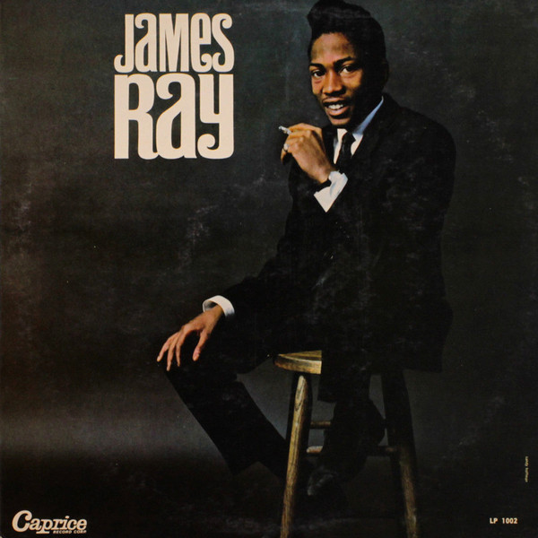

Born in Washington D.C during the year 1941, James Ray is an African-American singer also known as Little Jimmy Ray in the earliest of his career.

He is known for the songs "[If You Gotta Make a Fool of Somebody](https://www.youtube.com/watch?v=sperNZW6A8k)" (number 22 on the Billboard Hot 100 in 1962) and for the original version of "[I Got My Mind Set on You](https://www.youtube.com/watch?v=qSCEie9KqvQ)" which met fame with the [George Harrison version](https://www.youtube.com/watch?v=6ZwjdGSqO0k).

James Ray died from a drug overdose in 1963, 10 months after the release of his first album (James Ray LP), which includes underrated songs like "[St. James Infirmary](https://www.youtube.com/watch?v=lAP2bfSE_2s)", "[Without A Song](https://www.youtube.com/watch?v=vVQ447pzuzU)", "[It's Been A Drag](https://www.youtube.com/watch?v=Z8zyY8Q37fk)" and many others.

Died to soon and without any considerations (date of death and his burial place remains unknown), this artist deserves better. "Where is James Ray ?" website is a tribute to James and intend to gather informations, photos, any documents about Ray's life. If you met him or know something, please contact us: [remidebord[at]hotmail.fr](mailto:remidebord@hotmail.fr).
