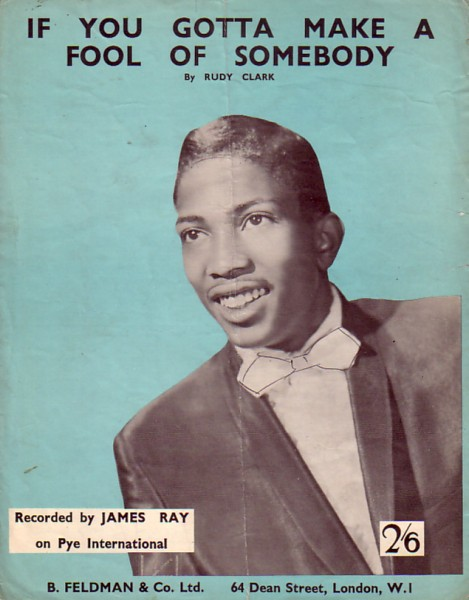
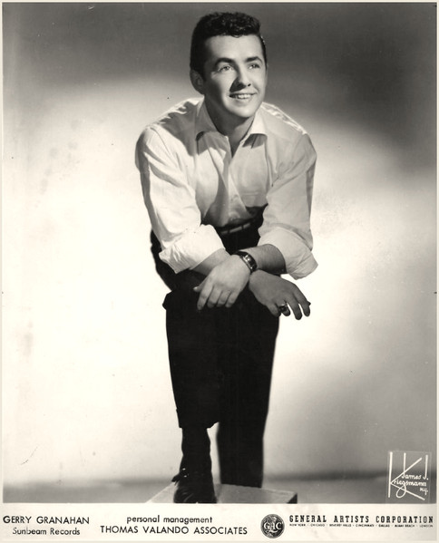
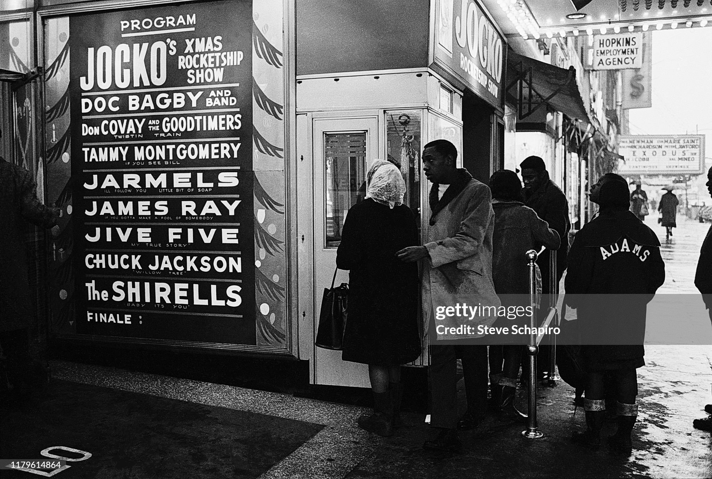
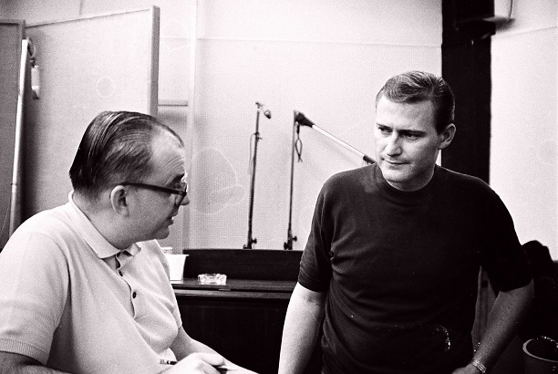

# James Ray - "THE LOST SOUL MAN"

Mike Fenton recalls the short career of James Ray, with the help of the artist's mentor Gerry Granahan.

__It's one of the most tragic and frustrating tales of the 1960s music industry, the classic example of a wasted talent, a young life thrown away in the lonely trajectory of a mysterious death. James Ray's star bumed brightly but briefly - he was indeed, not just the _lost soul man_ in terms of his music, but also the proverbial _lost soul_ whose life could have contributed so much more given the right environment and sympathetic guidance. Virtually all I know of James Ray and his music comes from a fairly full collection of his recordings and the time spent with his mentor and label boss, my friend Gerry Granahan.__

	
	
James Ray - Pye International records

There are two well-known starkly contrasted images of James Ray. On the UK sheet music edition for his best known hit song (B. Feldman & Co., London, 2/6d) James poses urbanely in bow-tie and tuxedo with meticulously-processed hair; on the front liner of his one album he sits shyly on a stool in a suit borrowed from his Caprice Records boss Granahan, nervously holding a cigarette. James Ray's recording of [If You Gotta Make A Fool Of Somebody](https://www.youtube.com/watch?v=sperNZW6A8k) was one of the quirkiest rhythm and blues records of its era, unique in the genre with its three-four time, the absence of a bass, with its arrangement dominated by a tuba and waiting harmonica.

In the USA the record rose to number 22 on the [Billboard Hot Hundred in January 1962](https://www.billboard.com/charts/hot-100/1962-01-27/), number 10 R&B and number 18 on the [Cashbox chart](https://tropicalglen.com/Archives/60s_files/19620127.html). it did little business here despite reasonable airplay on Radio Luxembourg, but purchasers of the disc almost certainly included John Lennon and George Harrison. Indeed, the Beatles were known to have featured the song at The Cavern, where it may have been heard by one Freddie Garrity, who two years later was to take a limp milksop revival of it (you couldn't really call it a cover version two years on) high on the UK charts. It was further revived by soul diva Maxine Brown, who had a number 63 peak on Billboard with it in January 1966. You heard the influence of Ray's disc in the bluesy harmonica on [Love Me Do](https://www.youtube.com/watch?v=0pGOFX1D_jg), the Beatles debut for Parlophone, which gave the groups chart career a modest kick-start in October 1962, a fairly low key prelude to the hysteria to come.

The unique character of [If You Gotta Make A Fool Of Somebody](https://www.youtube.com/watch?v=sperNZW6A8k) was in like company when it was included on the singer's debut album later in 1962. With a voice that sat somewhere between the hoarse deiiveiy of Little Willie John and the soulful edge of Bobby _Blue_ Bland, the album stands today as one of the early lost soul albums, emerging well before the term _Soul_ was truly extant, although the word received some mileage in the liner notes by one Jess Strum. The album was unique in its content, its variety, its arrangements, and the sheer class of the vocals, a collection that stands today as effectively Ray's _Memorial Album_.

Born __James Ray Raymond__ in [Washington, D.C.](https://en.wikipedia.org/wiki/Washington,_D.C.) in __1941__, little is known of his early life or musical influences, not even his birthdate. He is known to have attended [McKinley High School](https://www.mckinleytech.org/) in the capital, and may have had a brief __US Army career__. He re-located to __New York City in 1959__, and made his first appearance on record under the auspices of __George Goldner's Gone/Gee/End__ group of labels. There's even a mystery attached to this - the disc was cut for a small Goldner subsidiary, [Galliant](https://www.discogs.com/label/611011-Galliant) — or was it __Gallant__?

Galliant was the authentic correct name, I believe, with a label address shown as [1650 Broadway](https://maps.app.goo.gl/PXgHA8BWfoGRX6pa9). There are apparently copies in existence under both names, maybe one of the issues being a result of an error at the printers?

Or were those discs on Gallant bootlegged copies? You see copies of the disc on-line with no composing credits listed on the label, and you wonder about the provenance of these. The plug side, [Make Her Mine](https://www.youtube.com/watch?v=r0ptmu3QHI8) was penned by Richard Barrett, he of Chantels mentorship, whereas [You Need To Fall In Love](https://www.youtube.com/watch?v=a21ujJ22t3s), the flip, was composed by Ray (_Raymond Ray_), ironically, in view of their vocal similarities, with a minor key styling lifted from Little Willie Johns _Fever_. The disc is impossibly rare and likely to be expensive if you find a copy - a recent US dealer’s price on Discogs ran close to £200. As a debut disc, it was an impressive start, the voice unmistakeable with its tortured and groaning delivery.

	
	
Gerry Granahan

In 1961, music business chameleon [Gerry Granahan](https://en.wikipedia.org/wiki/Gerry_Granahan) was exploring pastures new. He had scored a Top 30 US hit in 1958 with the oddly-titled session throwaway, _No Chemise Please_, a record he still regards as _a freaky mistake_. He had also achieved chart success as a member of The Fireflies (_You Were Mine_) and Dicky Doc & The Don'ts (_Click Clack_), and it's a little-known fact that his producers hat was behind the original of _Wild Thing_ by The Wild Ones for United Artists, a disc more commonly associated with The Troggs, an English group from Andover. Now in the process of forming his own record label, [Caprice Records](https://www.discogs.com/label/138140-Caprice-3) [[2](https://www.bsnpubs.com/nyc/canam/caprice.html)], he visited New York looking for talent. After some initial success with The Angels and Janie Grant, at this point Granahan and a gifted New York songwriter were to become the two major catalysts in the James Ray story. [Rudy Clark](https://en.wikipedia.org/wiki/Rudy_Clark) was a Manhattan mailman who delivered the post to the Caprice office. He was also a budding songsmith who began pitching his songs to the label.

Rudy was a competent pianist, but not blessed with a great singing voice. Gerry was impressed with the songs and wanted to encourage the young writer, but felt that he needed someone special to sing them. At this time James Ray was finding living in New York to be a thankless and trying experience, reduced to singing on the street, occasionally picking up a small night club gig and raiding restaurant bins for food. Clark found a destitute Ray living rough on the roof on top of his apartment block. At some point though, maybe on the street, maybe in a club, he heard him sing; Granahan said, "It was Rudy who alerted me to James. He brought him in and I first heard him singing in a practice room. __He was singing with such power it just bowled me over__. There wasn't even any sound equipment in that particular room and when I looked in there was this little guy singing and projecting like nothing I had ever heard! Rudy was one of our writers and was to pen _The Snoop Shoop Song_, which was a hit for Betty Everett, but nothing of his seemed to suit the artists I had, so I was looking for someone who could do his songs justice. So here he was, James was just the man. Look at the album cover - that's my clothes he's wearing, he didn't have any. __He was so small, five feet tall, never looked healthy, but he could sing up a storm and every time he opened his mouth I got the chills__. I saw him further on down the road as the next Ray Charles, he had that gift. I loved that kid but he just got in with the wrong crowd. As soon as he started making money from his two hits they started
showing him the candy."

With [If You Gotta Make A Fool Of Somebody](https://www.youtube.com/watch?v=sperNZW6A8k) rising up the US charts during November/December 1961, James received an invitation to appear on the WWRL - Amsterdam News show for the needy held in the [St. Nicholas Arena in New York City](https://en.wikipedia.org/wiki/St._Nicholas_Rink) on 20th December. Bearing in mind his living conditions of only several months previously and the charitable purpose of the concert, this must have been a great if bittersweet experience for the twenty-year old, working with such luminaries as Brook Benton, Chuck Jackson and Count Basie.

Only two days later (22th December 1961) he began a two week run at [Harlem's Apollo Theater](https://www.apollotheater.org/about/history/), with his hit record at number 49 on the Billboard Hot Hundred. He was joined on the bill by the Shirelles, Chuck Jackson, the Jive Five, the Jarmels, the Marvelettes, Tammy Montgomery, Don Covay and jazz and r&b organist and arranger, Doc Bagby.

We have no details of his precise appearances, but the normal form of that period for a new artist was a short set comprising both sides of the hit single plus possibly one other song, presented in six shows a day, accompanied by the house band. One wonders if the accompaniment included the tuba and harmonica as on the record? At the end of his fourteen day run there, his hit had risen to number 29 on Billboard.

Apollo owner [Frank Schiffman](https://sova.si.edu/record/NMAH.AC.0540) kept an index card on every performer who appeared there, and his surviving card on Ray records that he was paid $500 (probably the weekly rate), and that the MC was Jocko (_The Ace From Outer Space_) Henderson, probably with one of his _Jocko’s Rocketship Revues_.

	
	
Apollo Theater - December 1961

The card, dated 25th December, concisely tells us _Had hit record — very well received_. if the Schiffman assessment appears somewhat scant, it is worth remembering that the owner could often be quite scathing and unsparing in such comments, so clearly Ray was a success there, but he never appeared again. I suspect that by the time [Itty Bitty Pieces](https://www.youtube.com/watch?v=56Tv8PjAF5Y) appeared on the Hot Hundred on 7th April, 1962, the diversions of his existence in New York may well have made the likelihood of a further Apollo invitation unlikely, although we do know from a New York Amsterdam News clipping of Saturday 14th July, 1962 that he appeared that weekend at the __Baby Grand club at 319, West 125th Street__, in company with the Soul Sisters, a duo who had a US Top Fifty hit two years later with _I Can’t Stand It_.

	
	
Vinyls records - Mike Fenton

__Caprice__ released three singles by Ray. The follow-up to the debut hit, [Itty Bitty Pieces](https://www.youtube.com/watch?v=56Tv8PjAF5Y), followed _Fool_ onto the US charts and peaked at number 41 on Billboard in a ten-week run (number 55 Cashbox), both sides penned by Rudy Clark, but the third [A Miracle](https://www.youtube.com/watch?v=s9y2VSHu2I8), non-Clark, failed to chart.

James made a surprise contribution to another of Caprice’s hits when he contributed a punch-line on Janie Grants [That Greasy Kid Stuff](https://www.youtube.com/watch?v=TkVEuM_4lBE) (Caprice 115) which reached number 70 on Cashbox in June 1962. The song was a catchy spoof on the use of Vitalis hair tonic on which James delivered the spoken line: "Doctor Livingstone, I presume!".

A third major player to burnish James Ray's legend and champion his music was __George Harrison__. Already motivated by the purchase of the two Pye international UK releases, the Beetle was in the USA in Benton, Illinois, in September 1963, visiting his sister Louise.

The __Beatles__ hurricane hadn't hit the USA yet. __On the trip he purchased a copy of Ray's Caprice album__, and was moved enough by its contents to refer to him as __his favourite singer__, so much so that 25 years later he recorded Rudy Clarks [Got My Mind Set On You](https://www.youtube.com/watch?v=_71w4UA2Oxo) and took it to the top of the UK charts, dropping the _I've_ from the title in the process.

Ray's original was only issued on the Caprice album, and the back liner curiously lists the song as Part I Part II, suggesting that it may have been intended for a 45 issue in a two-part form over two sides.

Indeed, its the longest track on the album by some distance at 3:28. Mysteriousiy, the song was eventually put out on a single in 1963, by which time Caprice no longer existed, but only on one side using 1:49 of the album track, with another standard, Irving Berlin's [Always](https://www.youtube.com/watch?v=RwJwHDQvj_s) on the flip, on Dynamic Sound (503). The remainder of Ray's recording, the other 1:39, has never appeared on 45rpm. Any planned issue by Caprice of the full version on a single was
probably stymied by Granahan closing the label down early in 1963.

The Dynamic Sound 45 with just the sub-two minutes of [I've Got My Mind Set On You](https://www.youtube.com/watch?v=dSNbpBOf80A) remains a total mystery. It was nothing to do with Gerry Granahan, although the label looked similar to Caprice, black with arranger [Hutch Davies](https://en.wikipedia.org/wiki/Hutch_Davie) name in a little diamond. Granahan still has custody and ownership of all the Caprice masters, which begs the question, what was the source of the track used for the single?

	
	
Hutch Davie (left) and Papa Don Shroeder (right)

I think Davie is the likely answer, with his label credit on a disc that was issued in December 1962, and his liaison with Caprice about to be terminated by closure of the label. Did Davie own a separate master?

The eponymously-titled album stands as a monument to James Rays incredible ability, although it was not a commercial success at the time. It was recorded at __Regent Sound Studios on 57th Street in New York__. Caprice only ever put out one other album, by the Angels, on the strength of their hits, _'Til_ and _Cry Baby Cry_. Bob _Hutch_ Davie, hired as the labels musical director, had a reputation for experimentation, a maverick approach, and the whole album bears the imprint of his idiosyncratic style, to the extent that you can look at the primary key factors in Ray's music history in fourfold terms -- Granahan, Clark, Harrison and Davie.

Hutch was co-writer of _The Green Door_ and played piano on the number one hit version by Jim Lowe in 1956, and also was responsible for the arrangement on Santo & Johnny's classic steel guitar instrumental, _Sleepwalk_, in 1957. With a mix of Rudy Clark's originals and several standards, the confidence of Rays vocals on the album is extraordinary. These must have been expensive and sessions, and the variety is incredible - Sammy Cahn's classic smoothie, [Teach Me Tonight](https://www.youtube.com/watch?v=Z3g0ktzpZXs), has an orchestral setting with a key-change, Hoagy Carmichaels [Lazy Bones](https://www.youtube.com/watch?v=Apj1Cvkc55o) has Davie himself on piano with some phrases redolent of Floyd Cramer, and the hit, [Itty Bitty Pieces](https://www.youtube.com/watch?v=56Tv8PjAF5Y), has a stimulating-if-incongruous mix of girl group, harmonica and Tijuana-style brass. The jazz standard [St. James Infirmary](https://www.youtube.com/watch?v=lAP2bfSE_2s) has an unbelievable blend of Strummed four string banjo, a string quartet and a trad jazz band finale, whilst [Welcome To The Floor](https://www.youtube.com/watch?v=xDs6FBXgC60) is a stylish Rudy Clark song about the joys of dancing which would have made a great Twist-era single.

And standing tall above everything is the majestic [I've Got My Mind Set On You](https://www.youtube.com/watch?v=dSNbpBOf80A), with its plectrum banjo tremolo, shrieking white choir and big band feel. This was the period when rhythm and blues was beginning its mutation into soul, and this album was an early part of that germination process - what comes over is the warmth and clarity of Rays smoky vocals, how much in control of the situation he appears to be despite his youth and personal difficulties, Davie's lavish and oft-eccentric settings, and the maturity of the singers expressive abilities without the later histrionics that became part of the Soul scene. You can read a fine appreciation of Ray on-line by Frank M. Young, in which he refers to the _oddball arrangements of Hutch Davie_ and their _indescribable edge_. Gerry Granahan recalls of the album: "James was one of a kind, boy, I tell ya. A tough little guy. Hutch was a little strange, but had some great ideas. James was right in Hutch's bag! Those songs, [Lazy Bones](https://www.youtube.com/watch?v=Apj1Cvkc55o), I think they were chosen by Hutch, but it was a good mix, the standards and Rudy's songs. There were some crazy sessions on that record. We always tried to get away from _You can't do that!_ Hutch was always trying things. [If You Gotta Make A Fool Of Somebody](https://www.youtube.com/watch?v=sperNZW6A8k) was a very innovative record — it was Hutch's idea to bring in the tuba, and Buddy Lucas
playing harmonica. Lucas did the very last 45 we put out on a new artist at Caprice. The combination of James with Rudy's songs was pure magic. I think the Janie Grant record should have been a lot bigger, the song with James singing the _Dr. Livingstone_ line!"

Mint copies of the album are worth around $100-$120 these days, although rarer stereo copies can fetch about half-as-much again. An EP release in 1963 (Caprice 1002) took four tracks from the album, these being [Come Rain Or Come Shine](https://www.youtube.com/watch?v=2uZ1bjzcJME), [St. James Infirmary](https://www.youtube.com/watch?v=lAP2bfSE_2s), Rudy Clark's [The Old Man And The Mule](https://www.youtube.com/watch?v=9H6uo_a24xU) and [Lazy Bones](https://www.youtube.com/watch?v=Apj1Cvkc55o).

Although still popular in the UK, very few records were issued in this format in the USA by this time, and this disc must have been one of the very last American EP issues. It is thought that it was intended as a promotional tool to help draw attention to the twelve-track album. It seems that the album did little for Ray's profile at the time, despite its quality and originality, for, as Gerry Granahan ruefully recalls, the diversions of dubious company and the drug scene were preventing his protégé from maintaining his career focus: __"We tried to keep him out of trouble but it became impossible. We got him an apartment in Manhattan so we could keep an eye on him, but it was tough. All the scumbags came after him after they smelled the hit records. I remember he performed at the Apollo and he went over really well, but I gather he met Little Willie John there and they didn't get on too well. I think Willie was irritated by James's vocal style being similar to his. They were similar in stature too, both quite small!"__

Gerry's reference to James at The Apollo raises a tantalising possibility. __The Harlem theatre had an unofficial house photographer, Gordon 'Doc' Anderson__, who recorded every act on camera that went across that stage. He would pay to get into the early shows each day, shoot the pictures, then run back to his apartment and develop the photographs in his bathtub. He would return later in the week and sell the images to the performers as souvenirs of their _Apollo Moment_. I have seen copies of these composites in the possession of Gary (U.S.) Bonds and Earl-Jean McCrea and they are remarkable, featuring all the artists on the bill, the billboard outside the theatre, with an artist at the centre who A presumably was the subject of that particular sale. Unfortunately, if the pics didn't sell, he generally destroyed them and the negative. But, you think somewhere __there must still exist a photograph of Ray on stage at the Apollo!__

__James Ray career at Caprice was terminated early in 1963 when Gerry Granahan folded the label__ after issuing just 21 singles, two EPs and two LPs. This was caused by problems with business associates, and was a great disappointment to him. Talking to me about it in November, 2018 he told me: "Yes, Caprice was my baby. I loved the work, and I was only in my twenties when I founded the label. I was out there looking for talent, making and producing the records, then when they came out I wanted to make sure they got played, so I was out visiting radio stations, jumping on planes all over the USA. What I didn't know was that while I was out, my business partner, Neil Galligan, was selling stock for cash. He'd say that Henry Stone called from Florida and wanted 500 of this, 200 of that, and when a distributor asked for a break he'd sell to him cheaper if it was cash. So a lot of money went missing that way. A distributor nearby in New Jersey alerted me to what was going on."

With the demise of Caprice, __James Ray was signed to the Congress label__, started by none other than Hutch Davie and Granahan's erstwhile business partner, __Neil Galligan__. Congress was a subsidiary of __Kapp Records__, which ensured good distribution, but there were no more hits. Had any of them had chart success, any resulting UK issue would have been on London American, with which Kapp had a licensing agreement for Britain. He must have been a true fish-out-of-water at Kapp/Congress, the company hardly being a bastion of black music to any noticeable degree. Four singles were issued during 1963-1964, and although I've read comments that these records had lost the spark, the magic, of the Caprice recordings, I don't completely agree. Mainly for two reasons; James could still _sing up a storm_, in Gerry Granahans words, and Hutch Davie was still involved. All four singles bear his imprint, with appropriate label credit, although, in truth, they sound as if the arranger was not in quite such an experimental groove as at Caprice. But half the issued songs were by Rudy Clark, so how could there not be some serious quality there?

The first Congress single featured a track clearly licensed from Caprice,  [The Old Man And The Mule](https://www.youtube.com/watch?v=9H6uo_a24xU), the same cut as on the Caprice album and fairly ironic subject matter considering the lifestyle that was to lead to the singer’s early death.

The Clark-penned song was coupled with an living Berlin standard, [Marie](https://www.youtube.com/watch?v=xVRQULoAq8U), on which a promising first verse blues mutates into a repetitive rocker. Ray's only concession to dance craze fervour was a gimmicky [Do The Monkey](https://www.youtube.com/watch?v=4VttO0uJH_Q), notable for gratuitous jungle noises and for Bobby Darin making a surprise appearance as co-writer! The real gem of the Congress recordings is [Put Me In Your Diary](https://www.youtube.com/watch?v=sTOyZlzDekQ), a gorgeous wistful reading of another Rudy Clark. Lyric with Hutch excelling on piano and a smooth supportive brass arrangement. I would love to know who Rays influences were, whom he listened to. I can hear Sam Cooke at his best in this performance, probably my favourite of the little guy's short career.

Finally, on his last record of all, you hear a solid step into the soul era on both sides of CG 218, an impassioned attack on [On That Day](https://www.youtube.com/watch?v=Lg7g_tXujyg) with girl group prominent and Ray's only monologue on record. Flip it over and the title of [We Got A Thing Goin' On](https://www.youtube.com/watch?v=jUdfMkWEpFQ) reflects the lexicon and energy of the 1960s and where he was going had he lived, with more than a nod to Joe Tex and Bobby Bland.

It is not known precisely which of the Congress releases were posthumous. i suspect maybe just the last two, but this is unconfirmed. __He died from a drug overdose, as far as we know, probably sometime during 1963__. Granahan has stated that he put out Ray's album and maybe ten months, a year later, he received a call at Caprice's office from the police who'd found his body. The LP was issued in July 1962, so if his memory is correct on this, ten-twelve months on from there takes us to mid-1963. it is therefore possible that his death occurred in New York City around May-June of that year.

As for a precise date, apparently even the American Social Security Death index has no relevant information on the case. You wonder if George Harrison knew of his hero being deceased when he brought his treasured album acquisition back from the USA?

The tragedy of Ray's life is reflected in Gerry Granahan's final words on him: __"Everything happened so fast. With no more hits, he continued to throw away his money on drugs. He'd got on dope and killed himself. I received a call from the New York City police and I had to go to the mortuary to identify the body. It broke me up, I loved that kid, and we really tried to protect him but it was no use. I did everything I could to help him. He was dead from drugs at 22 and I was the last one to see him alive. There was no funeral and he's buried somewhere in Brooklyn, I contacted his mother in DC but she wouldn't accept him — she just told me: "You just bury him up there." I was away out of town and he'd been buried by the time I got back."__

Tragic beyond belief. His mother wouldn't accept him? Did you ever hear such awful words? And the missing details in the story serve to underline the fragile loneliness of his life, no mentions of a girlfriend, little relating to family, or a close personal relationship of any kind, just the testimonies of his label boss who clearly cared about him and believed in his ability, but couldn't fight the culture of parasitic greed in the drug scene on the New York streets which sucked him in and drew him to a lonely demise.

It was a total waste of a life which could have prospered mightily with the talent he had. Had he lived, I could have pictured an occasion when he would one day very likely have taken the stage to duet with ex—Beatie George on [I've Got My Mind Set On You](https://www.youtube.com/watch?v=dSNbpBOf80A), maybe with a proud Rudy Clark in the audience.

__All photos and graphics in this article courtesy of Mike Fenton. The author would like to gratefully acknowledge the assistance of Gerry Granahan in the preparation of this remembrance of James Ray.__

